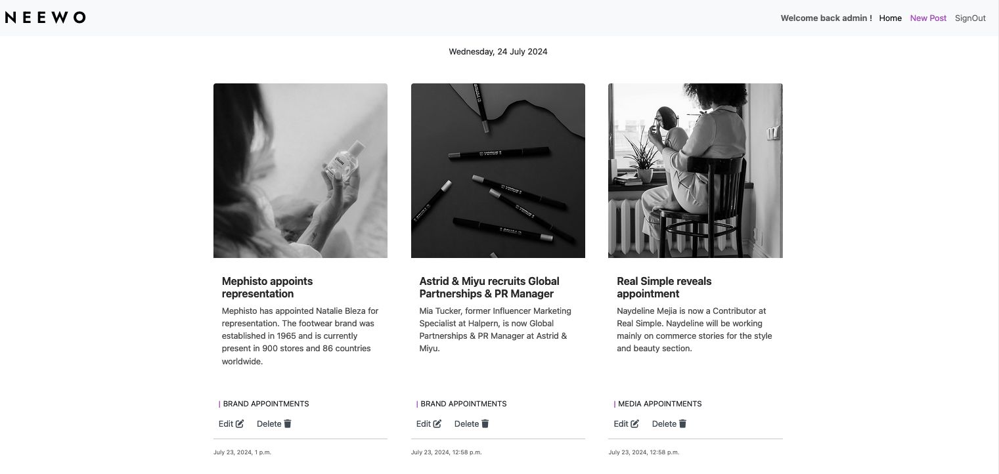
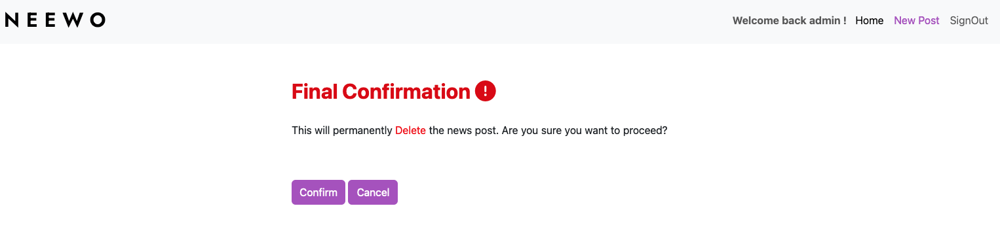

<h1>NEEWO: Fashion and Beauty News Portal</h1>

<h3>Overview</h3>

[NEEWO](https://neewo-a26db386d628.herokuapp.com/), your go-to source for the latest fashion and beauty news. Get the scoop on runway trends, celebrity styles, makeup tips, and skincare advice. Discover in-depth articles, exclusive interviews, and expert insights in the world of fashion and cosmetics.
 
<h3>Project Description</h3>
NEEWO is a Django-based web application designed to provide users with up-to-date fashion and beauty news. The platform offers various features for both administrators and regular users to enhance their experience.

 
<h2>USER EXPERIENCE</h2>

<h3>Admin Features</h3>

 1.  Post News: Admins can create and publish new articles about fashion and beauty trends. 
 
 
 
 2.  Edit News: Admins can edit existing news articles. 
 
 
 
 3.  Delete News: Admins can delete news articles that are no longer relevant or appropriate. 
 
 
 
 4.  View Likes: Admins can view the number of likes on each news article. 
 5.  Comment Management: Admins can view, approve, or delete comments made by users. 
 6.  News List Management: Admins can view a list of all news articles. 
 7.  Account Registration: Admins can manage user registrations and accounts. 
 8.  News Categories: Admins can create and manage different categories for news articles. 
 9.  Site Pagination: Admins can configure pagination settings for the site. 
 10. View Comments: Admins can see all comments on articles. 
 11. Number of Likes: Admins can view the total number of likes for each article. 

<h3>User Features</h3>

 1. View News List: Users can browse through a list of all published news articles. 
 2. Comment: Users can comment on news articles. 

 
 
 3. Like: Users can like news articles. 
 
<h2>FEATURES</h2>

<h3>Navigation</h3>
The navigation feature of the NEEWO fashion and beauty news website is designed to provide a seamless and intuitive user experience. 
Utilizing Bootstrap for its robust framework, the navigation bar ensures a consistent and responsive design across various devices. 

Navigation Bar Elements 
1. Brand Logo 
    * Location: Positioned on the far left of the navigation bar. 
    * Purpose: Acts as a clickable element that redirects users to the homepage. 
    * Design: The logo is prominently displayed to maintain the visual identity of NEEWO. It is designed to be clear and recognizable, ensuring users can easily identify the brand. 
2. Home Link 
    * Location: On the right side of the navigation bar, next to the brand logo. 
    * Purpose: Provides a direct link to the homepage, allowing users to quickly return to the main landing page from any part of the site. 
3. Login Link 
    * Location: On the right side of the navigation bar, next to the Home link. 
    * Purpose: Directs users to the login page, allowing existing users to access their accounts. 
    * Design: Styled to be visually consistent with the "Sign Up" link. 
4. Sign Up Link 
    * Location: On the right side of the navigation bar, next to the Login link.
    * Purpose: Provides a link to the sign-up page where new users can create an account.
    * Design: Styled as a button to stand out from other navigation elements, using a contrasting color to draw attention.
5. New Post Link (Visible to Admins Only)
    * Location: On the right side of the navigation bar, next to the Sign Up link.
    * Purpose: Directs admin users to a page where they can create a new post.
    * Design: Visible only when an admin is logged in, ensuring regular users do not see this option. Styled similarly to other links for visual consistency.
6. Welcome Back Message (Visible When Logged In)
    * Location: On the right side of the navigation bar, replacing the Login and Sign Up links when a user is logged in.
    * Purpose: Greets the logged-in user with a welcome message, enhancing the personalized user experience.
    * Design: A text message like "Welcome back, [Username]!" displayed in a friendly, welcoming manner.
7. Sign Out Link (Visible When Logged In)
    * Location: On the right side of the navigation bar, next to the welcome message.
    * Purpose: Allows logged-in users to sign out of their accounts.
    * Design: Styled similarly to other navigation links to maintain visual consistency, with clear labeling to distinguish it from other navigation options.
Responsive Design with Bootstrap 
* Desktop: The navigation bar displays all elements horizontally in a clear and organized manner, with the brand logo on the left and the navigation links (Home, Login, Sign Up, New Post for Admins) on the right. When a user is logged in, the Login and Sign Up links are replaced with a welcome message and a Sign Out link. 
* Tablets: The layout adjusts to ensure that navigation elements remain accessible, often by slightly resizing or repositioning elements to fit the screen. 
* Mobile: The navigation bar collapses into a hamburger menu, which can be toggled to reveal the navigation links. This ensures that the navigation remains user-friendly and doesn't overcrowd the screen.
This responsive design ensures that users have a consistent and smooth navigation experience regardless of the device they are using, while also providing necessary administrative functions when an admin is logged in, personalizing the experience for logged-in users, and offering a sign-out option for convenience.

<h4>Navbar Admin</h4>

<h4>Responsive Navbar Guest </h4>

<h4>Responsive Navbar User </h4>

<h3>Homepage</h3>
The homepage of NEEWO showcases a dynamic news list, displaying the latest articles along with their associated images. Each news item includes a link to the detailed article page and indicates the category of the post. This structured layout ensures that users can quickly access the most recent and relevant fashion and beauty news.  

<h3>Article Detail Page</h3>
Each news article page includes: 

 * Title and Author: The title of the article and the author's name. 
 * Publication Date: When the article was published. 
 * Content: The main body of the article with images, videos, and text. 
 * Comments Section:
     * If the user is logged in, they can leave a comment in the designated comment section. 
     * If the user is not logged in, they will only see the list of existing comments but won't have the option to comment. 

<h3>Sign Up and Login Pages</h3>

 * Sign Up Page: New users can create an account by providing necessary details such as username, email, and password. 
 * Login Page: Existing users can log in to access more features by entering their username and password. 
 * Welcome Message: Once logged in, users are greeted with a personalized welcome message like "Welcome, Admin" or "Welcome, User." 

<h3>Footer</h3>

The footer of the website includes social media links, allowing users to connect with NEEWO on various platforms: 
 * GitHub 
 * LinkedIn 
 * Instagram 
 

<h3>Admin Dashboard</h3>
The admin dashboard provides easy access to all administrative features: 

 * Post New Article: A form for creating and publishing new articles. 
 * Edit Article: A form for editing existing articles. 
 * Delete Article: An option to delete articles. 
 * Manage Comments: A section for approving, editing, or deleting user comments. 
 * View News List: A list of all articles with options to edit or delete them. 
 * User Management: Tools for managing user accounts and registrations. 
 * Category Management: Options for creating and managing article categories. 
 * Settings: Configure site settings such as pagination and view statistics on likes and comments. 
 

<h2>WIREFRAMES</h2>
I've designed wireframes to layout the structure of your fashion and beauty news website, focusing on a clean, user-friendly, and responsive design. 

<h3>Homepage</h3>

<h3>News Detail Page</h3>

<h3>Sign In Page</h3>

<h3>Sign Up Page</h3>

<h2>DESIGN & COLORS</h2>
The design of NEEWO is sleek and modern, using the following color scheme:

 * #000000 (Black): Used for text and other primary elements. 
 * #a74ebf (Purple): Used for highlights, buttons, and other important accents. 
 * #ffffff (White): Used for backgrounds and text. 

<h3>Image Styling</h3>
All images on the site are displayed with a grayscale filter to create a chic and timeless aesthetic.  The CSS for this is:

 

  
<h2>TESTING</h2>
<h3>CI Python Linter</h3>

<h4>settings.py</h4>

<h4>views.py</h4>

<h4>views.py</h4>

<h4>models.py</h4>

<h4>forms.py</h4>

<h4>forms.py</h4>

<h4>admin.py</h4>

<h4>urls.py</h4>

<h4>app/urls.py</h4>

<h3>HTML Validation</h3>

<h3>CSS Validation</h3>

The project is deployed on Heroku. Ensure that all necessary environment variables and configurations are set up in the Heroku dashboard, including the database settings and static file handling. 

<h2>TECHNOLOGIES</h2>

<h3>1. Languages</h3>

* HTML5 
* CSS3 
* Python 

<h3>2. Frameworks, Libraries & Programs</h3>

<h4>Core Django Packages</h4>

* Django: The main framework to develop the web application. 
* Django Admin: For managing users, posts, and other models via the admin interface. 

<h4>User Authentication and Management</h4>

* django.contrib.auth: Built-in Django authentication system for user registration, login, and management. 
* django-allauth: A package that simplifies user authentication, registration, social account authentication, etc. 

<h4>Models for News Posts, Comments, and Likes</h4>

* Django ORM: For creating and managing database models. 
* Django Slugify: To generate URL-friendly slugs for news posts. 

<h4>Forms and Validation</h4>

* Django Forms: For handling user input and validating forms for creating and editing posts, comments, etc. 
* crispy-forms and crispy-bootstrap5: To style Django forms easily and consistently using Bootstrap 5. 

<h4>Templates and Frontend</h4>

* Django Templates: To render HTML content. 
* Bootstrap: For responsive and modern UI components. 

<h4>Handling Media and Static Files</h4>

* django-storages: To handle file uploads (images, videos) efficiently. 
* Pillow: For image processing. 
* cloudinary and dj3-cloudinary-storage: For handling cloud storage of media files (images, videos). 

<h4>Additional Features</h4>

* django-summernote: For rich text editing in forms (e.g., when creating or editing articles). 

<h4>Database Configuration</h4>

* psycopg2: PostgreSQL database adapter for Python. 
* dj-database-url: For configuring the database from a URL (useful in production environments). 

<h4>Deployment and Environment Management</h4>

* gunicorn: WSGI HTTP server for serving your application. 

<h2>FUTURE FEATURES</h2>
 1. Newsletter: A feature to allow users to subscribe to a newsletter for regular updates. 
 2. Filter and Search for Categories: Advanced filtering and search options to find articles based on categories. 
 3. Contact Form: A contact form for users to reach out to the site administrators. 
 4. Subscribe Button: A button for users to subscribe to specific news categories or authors. 
 5. Share Button: Social media share buttons to share articles directly from the site. 
 6. Save for Later: A feature for users to save articles to read later. 
 7. Follow Other Users: Allowing users to follow other users to see their liked and commented articles. 
 

<h2>DEPLOYMENT</h2>

<h3>Heroku</h3>

Steps for deployment:

1. Click "New" and select "Create new app".
2. Input a meaningful name for your app and choose the region best suited to your location.
3. Select "Settings" from the tabs.
4. Set the buildbacks to python and NodeJS in that order.
5. Select "Deploy" from the tabs.
6. Link the Heroku app to the respository.
7. Select "GitHub - Connect to GitHub" from deployment methods.
8. Type GitHub repository by name.
9. Click Deploy Branch to deploy manually. Manually deployed branches will need re-deploying each time the repo is updated.
10. Click on Deploy.
11. Click View button to view the deployed site.

<h2>CONCLUSION</h2>

NEEWO provides a comprehensive platform for users to stay updated with the latest in fashion and beauty. With robust features for both administrators and regular users, the site ensures a seamless and engaging experience for everyone. The clean design, intuitive navigation, and efficient user management make it a reliable source for fashion and beauty news.
